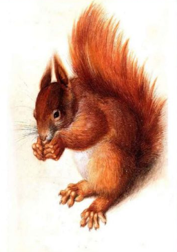

# My Awesome Website

## ***About Me***

I am a *communication and information technology student* who is passionate about creating amazing web applications.

I sutdy at [Oulu University of Applied Sciences]([https://duckduckgo.com](https://oamk.fi/)).

## ***My Skills***

- HTML
- CSS
- JavaScript
- C++

## ***Projects***

Check out my portfolio website to see my latest projects!

### **Project 1: Piirto-ohjelma**

I made a drawing program that can draw circles, squares, rectangles and lines

### **Project 2: Noppa** 

I made a dice game. Clicking the dice draws a new dice number

## *Contact Me*

Feel free to reach out to me at [t2ahja01@students.oamk.fi](mailto:t2ahja01@students.oamk.fi.)

